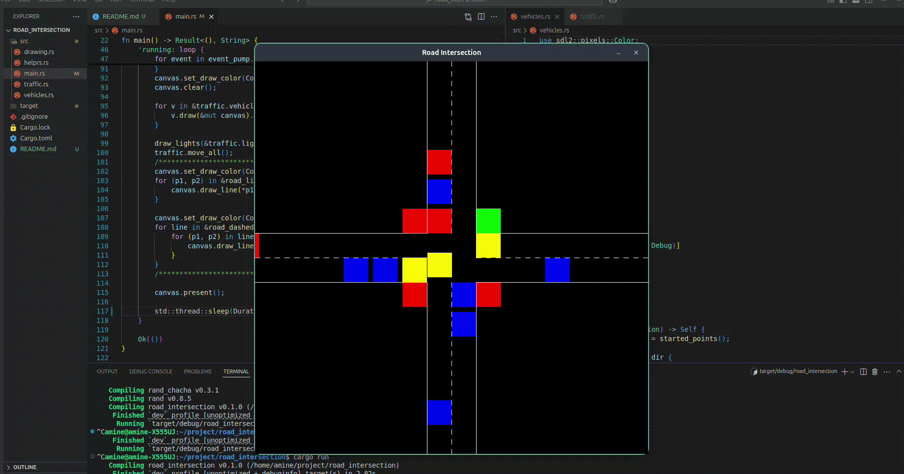

# Traffic Simulation

A traffic intersection simulation built in Rust using SDL2.

## Demo



<!-- Alternative options:
Video file: 
YouTube: [](https://www.youtube.com/watch?v=VIDEO_ID)
-->

## Project Structure

```
.
├── Cargo.toml
└── src
    ├── drawing.rs      # Rendering and graphics
    ├── helpers.rs      # Utility functions
    ├── main.rs         # Entry point and game loop
    ├── traffic.rs      # Traffic light control
    └── vehicles.rs     # Vehicle behavior and physics
```

## Vehicle Color Coding

- 🟡 **Yellow**: Left turn vehicles
- 🔵 **Blue**: Right turn vehicles
- 🔴 **Red**: Go forward vehicles

## Controls

| Key   | Action                              |
| ----- | ----------------------------------- |
| `↑`   | Spawn vehicle from south            |
| `↓`   | Spawn vehicle from north            |
| `→`   | Spawn vehicle from west             |
| `←`   | Spawn vehicle from east             |
| `r`   | Spawn vehicle from random direction |
| `Esc` | Exit simulation                     |

## Features

- Two intersecting roads with traffic lights
- Vehicles follow traffic lights (red = stop, green = go)
- Anti-congestion system (max 8 vehicles in queue)
- Collision prevention
- Safe following distance

## Setup

1. Install SDL2 development libraries
2. Run: `cargo run`

## Dependencies

```toml
[dependencies]
sdl2 = "0.35"
rand = "0.8"
```
